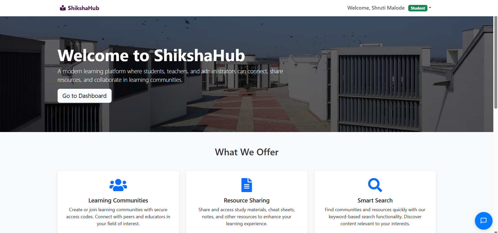
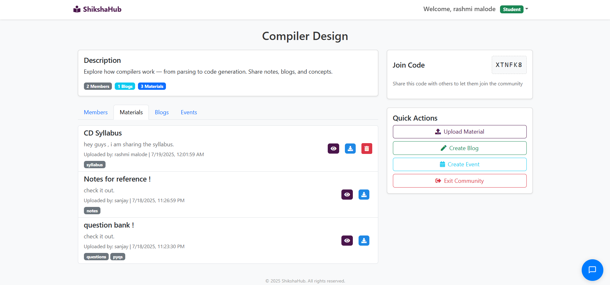
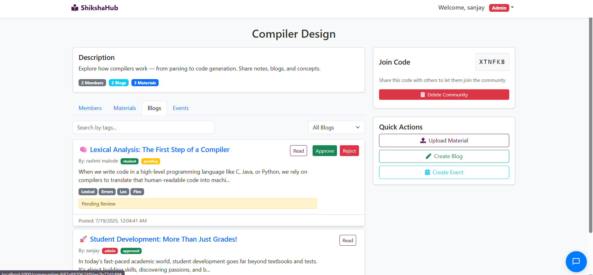
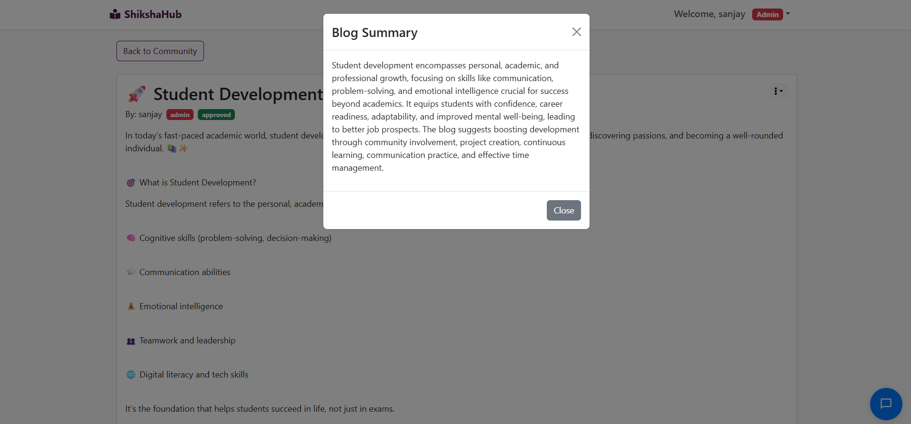
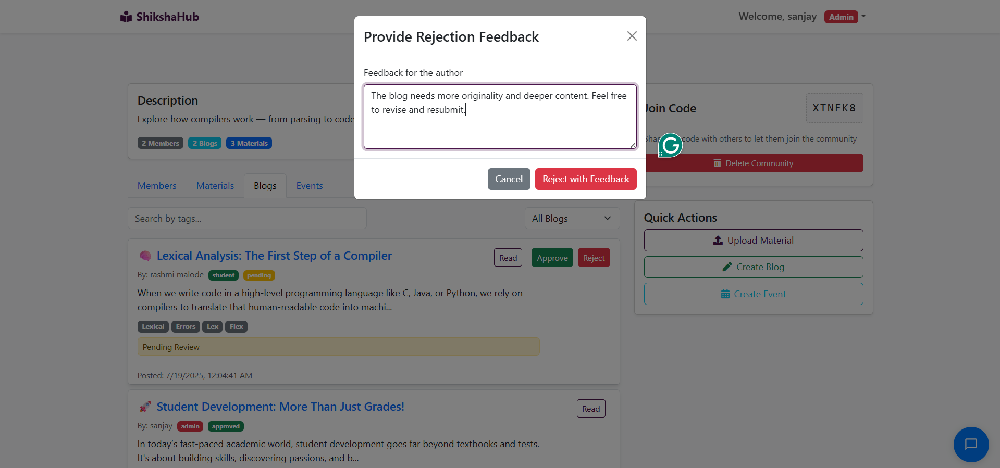

<h1 align="center">🎓 ShikshaHub - Centralized Platform</h1>

<p align="center">
  
  
  
  
</p>

> A **comprehensive platform** that connects **students, teachers**, and **educational content creators**.  
> Enables learning through communities, study materials, blogs, events, AI chatbot, and more.

---

## 📸 Demo

🔗 **Live Demo**: [Click here to visit ShikshaHub](https://myshikshahub.netlify.app/)

## 🖼️ Screenshots

Below are some screenshots of the platform:

<p align="center">
  
  
  
  
  
</p>

---
## 🚀 Features

- 🔐 Role-based Authentication (JWT)
- 👨‍🏫 Community-based Learning
- 📚 Study Material Upload with Cloudinary
- ✍️ Blog Management with AI Summarization
- 📅 Event Creation within Communities
- 💬 Real-time Chat + AI Chatbot (Gemini)
- 📧 Automated Welcome Emails
- 📱 Responsive UI with React-Bootstrap

---

## 📁 Folder Structure

```bash
shikshahub/
├── backend/
│   ├── controllers/
│   ├── models/
│   ├── routes/
│   └── utils/
├── frontend/
│   ├── components/
│   ├── pages/
│   ├── assets/
│   └── utils/
├── .env
├── README.md


📖 API Overview
🔐 Authentication - /api/auth
Register/Login with JWT tokens

Password encryption with Bcrypt

Sends Welcome Email on registration

🏫 Communities - /api/communities
Admins can create/manage communities

Users can join/leave and participate

📚 Study Materials - /api/materials
Upload via Multer to Cloudinary

Categorization & file search

✍️ Blogs - /api/blogs
Role-based blog approval

AI-powered Summarization (Gemini)

Blog interactions and comments

📅 Events - /api/communities/:id/events
Create/view events inside communities

Date, time, location, links supported

💬 Chat - /api/chat
Real-time messaging using Socket.io

AI Chatbot integration (Gemini)

### File Storage
- **Cloudinary storage for study materials**
- Secure file access (only authenticated users can upload)
- Organized storage structure in Cloudinary
- **Note:** Uploaded study materials are stored in Cloudinary and linked to materials in the database via their Cloudinary URLs.

## Features
1. User Authentication and Authorization
2. **Welcome Email Notifications** - Automated welcome emails for new users
3. Community-based Learning
4. Study Material Management
5. Educational Blogging
6. Real-time Chat System
7. File Upload and Management
8. AI Integration for Enhanced Learning (blog summarization, chatbot)
9. Responsive Design
10. **Event Management** - Create and manage events within communities

## Role-Based Permissions
- **Admin:** Can create communities, auto-approve their own blogs, review all blogs, manage all events and users.
- **Teacher:** Can review/approve/reject student blogs, create and join communities, create events.
- **Student:** Can join communities, create blogs (subject to approval), participate in events.
- **Community Events:** Only members of a community (admin, teacher, or student) can create/view events for that community.

## Email System

### Welcome Email Feature
- **Automated welcome emails** sent to newly registered users
- **Beautiful HTML email templates** with modern styling
- **Customizable content** including features list and call-to-action
- **Non-blocking email sending** - doesn't affect registration speed
- **Error handling** with detailed logging

### Email Setup
To enable email functionality, set the following environment variables in your `backend/.env`:
```
EMAIL_USER=your-email@gmail.com
EMAIL_PASSWORD=your-app-password
EMAIL_DEBUG=true               # Optional: set to true for verbose email logs
```
- For Gmail, you must use an app password (not your regular Gmail password). Enable 2FA and generate an app password in your Google Account settings.

### Email Template Features
- Responsive HTML design
- Welcome badge display
- Feature highlights
- Call-to-action button
- Professional styling

## Blog System Features

### Blog Approval System
1. **Role-Based Approval:**
   - Admin blogs are auto-approved
   - Teacher blogs require admin approval
   - Student blogs can be approved by teachers or admins

2. **Approval Workflow:**
   - New blogs start in 'pending' status
   - Reviewers can approve or reject with feedback
   - Rejected blogs can be resubmitted after edits
   - Status changes to 'pending' when edited after approval

3. **Review Process:**
   - Teachers can review student blogs
   - Admins can review all blogs
   - Required feedback for rejections
   - Optional comments for approvals

### Blog Summarization
 **AI-Powered Summaries:**
   - Uses Google's Gemini AI model
   - Generates concise summaries
   - Available for all blog posts
   - Helps with quick content understanding


### Blog Management
1. **Content Types:**
   - Original content
   - Shared content with attribution
   - Source URL tracking
   - Author role tracking

2. **Content Organization:**
   - Tag-based categorization
   - Community-specific blogs
   - Search functionality
   - Status filtering

3. **User Permissions:**
   - Authors can edit their own blogs
   - Reviewers can approve/reject based on role
   - Community members can view approved blogs
   - Original authors can track content sharing

## Event System Features
- Create, view, and manage events within communities
- Only community members can create events
- Event details include title, description, links, location, date, and time
- Events are linked to their respective communities

